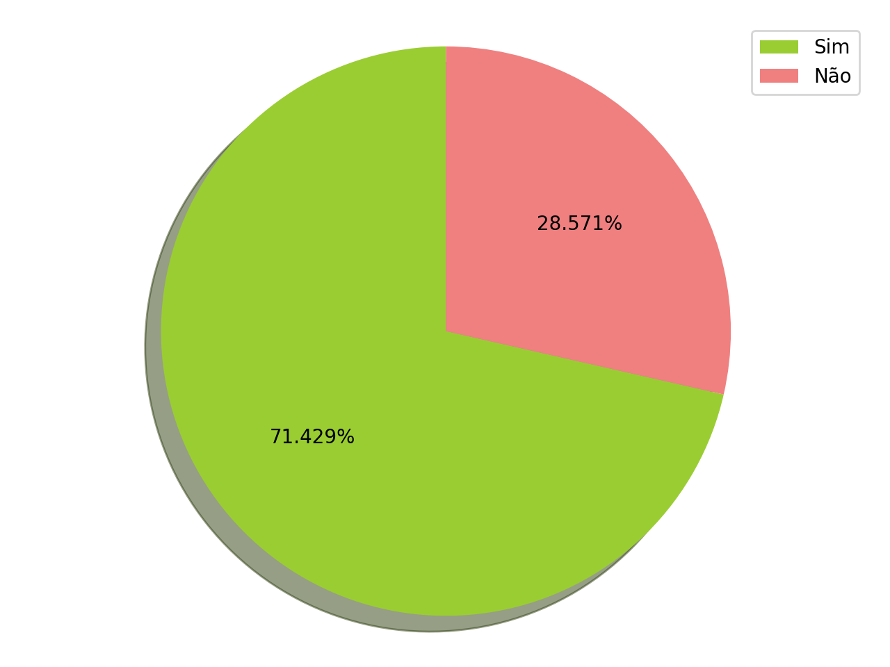

# Verificação do Brainstorming 

## Planejamento

Nesse documento encontra-se o detalhamento da organização do grupo para a realização da verificação dos artefatos deenvolvidos pela equipe, bem como a verficação do primeiro brainstorming realizado pelo grupo.

## Visão geral

 No primeiro Brainstorming realizado pelo grupo, o objetivo foi elicitar os principais requisitos do aplicativo Shazam, a partir de uma reunião presencial do grupo. 

O segundo Brainstorming teve por finalidade padronizar o métodos de verificação utilizado pelo grupo, bem como a estrutura da documentação de verificação dos artefatos, afim de organizar todos os documentos para eventuais correções e versionamentos.

## Rastreabilidade

* [Brainstorming](https://requisitos-de-software.github.io/2019.2-Shazam/elicitacao/brainstorming/)

## Etapas da verificação

### Checklist

Como o Brainstorming foi realizado verbalmente e presenciamente, os aspectos levantados nesse método não foram separados por tópicos. Sendo assim, as duas versões realiadas pelo grupo serão avaliadas seguindo um checklist em relação a como se deu o desenvolvimento do Bainstorming e não o conteúdo em si.

|Número|Questão|
|:---:|:---:|
|1|O documento está rastreado corretamente?|
|2|O documento possui versionamento correto?|
|3|Todos os membros do grupo tiveram liberdade para expressar sua opinião?|
|4|Todos os itens abordados foram registrados na documentação?|
|5|Algum membro foi reprimido no seu momento de fala?|
|6|Todos os membros tiveram  igual participação na construção de ideias do brainstorming|
|7|Alguma ideia foi descartada durante a realização do Bainstorming?|

### Resultados

|Questão|Atende|Atende parcialmente|Não atende|Motivo|
|:---:|:---:|:---:|:---:|:---:|
|O documento está rastreado corretamente?|||X|Não foi relacionado aos outros documentos após o início da rastreabilidade|
|O documento possui versionamento correto?|X|||
|Todos os membros do grupo tiveram liberdade para expressar sua opinião?|X||||
|Todos os itens abordados foram registrados na documentação?|X||||
|Algum membro foi reprimido no seu momento de fala?|||X|Todos os membros possuem libertade de expressão dentro da equipe|
|Todos os membros tiveram  igual participação na construção de ideias do brainstorming|X||||
|Alguma ideia foi descartada durante a realização do Bainstorming?|X||||

#### Visualização dos resultados

### Critério de qualidade

Apenas 1(um) item foi reprovado em relação à falta de informações no documento, o que classifica o Brainstorming realizado com qualidade alta, conforme o padrão de avaliação abaixo:

1 item reprovado - Qualidade Alta
2 itens reprovados -Qualidade Média
3 itens ou mais reprovados - Qualidade Baixa

## Correção

|Autor do documento|Inspetor|
|:--:|:----:|
|Nathalia Lorena|Débora|

## Versionamento

|Data|Versão|Alteração|Responsável(eis)|
|:--:|:----:|:-------:|:---:|
|04/11/2019|1.0|Criação do documento|Débora Vilela|
|05/11/2019|1.1|Adição de gráficos para melhor visualização| Gabriel Tiveron| 

## Referências

* SERRANO, Maurício; SERRANO, Milene. Requisitos - Aula 4. 1º/2019. 37 slides. Material apresentado para a disciplina de Requisitos de Software no curso de Engenharia de Software da UnB, FGA.s
