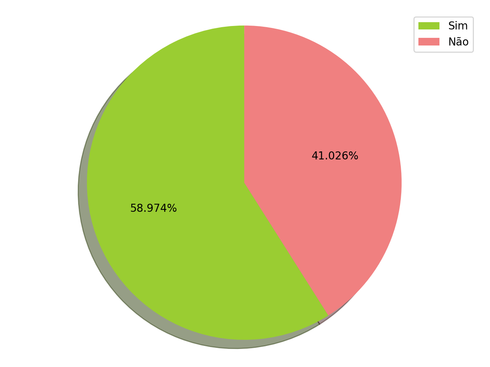
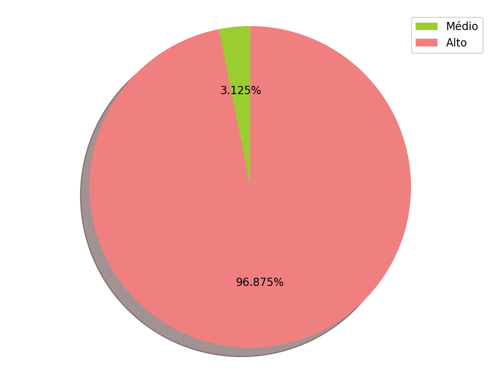

## Introdução

Este documento visa realizar a verificação no documento que relata os Casos de Uso e os seus respectivos diagramas verificando se o documento segue as especificações adequadas no tópico de modelagem de requisitos.

## Objetivos

Através do método de inspeções serão realizadas as verificações nos artefatos do documento. Por meio de um checklist abordando questões que o documento deve conter.

## Metodologia

Para a inspeção dos casos de uso será utilizada uma metodologia em que cada caso de uso, passará por uma tabela contendo um checklist e será julgado entre "sim" e "não" se a opção “não” for marcada, logo os artefatos não exercem as especificaçṍes adequadas, dessa forma, necessitarão de ajustes. Cada questão do checklist está dividida em uma escala de impacto, sendo este alto, médio ou baixo. A tabela também conta com a opção de possíveis modificações que o inspetor responsável pode sugerir para ajustar os artefatos avaliados.

## Verificação dos artefatos

*  [Especificação Casos de Uso](../modelagem/especificacao_dcu.md)
*  [Diagramas Casos de Uso](../modelagem/diagramas.md)

## Checklist Especificação de Casos de Uso

|Autor dos documentos| Inspetor
|:---:|:---:|
|Victor Levi| Nathalia Lorena

|Item|Questões |Respostas|Impacto|Modificações|
|:--:|:----:|:-------:|:---:|:---|
|**1** |O título é de fácil compreensão? |Sim | Alto | - |
|**2** |O título condiz com o objetivo do Caso de Uso? |Sim | Alto | - |
|**3** |Possui descrição?|Não | Moderado | - |
|**4** |A descrição aborda de forma correta o tema do caso de uso?|Não | Alto | - |
|**5** |Existe pré-condição? |Não | Moderado | - |
|**6** |A pré-condição está correta? |Não | Moderado
 | - |
|**7** |Possui ator principal?|Sim | Alto | - |
|**8** |O ator principal está representado corretamente? |Sim | Alto | - |
|**9** |O nome do ator principal condiz com seu papel? |Sim | Alto | - |
|**10** |Possui descrição dos atores? |Não | Moderado | Acrescentar descrição dos atores |
|**11** |Possui descrição dos Casos de Uso? |Não | Alto | Acrescentar descrição de cada caso |
|**12** |Possui fluxo principal? |Sim | Alto | - |
|**13** |O fluxo principal segue a ordem correta para a realização da tarefa? |Sim | Alto | - |
|**14** |Ao seguir o fluxo principal a tarefa é concluída com sucesso? |Sim | Alto | - |
|**15** |Possui fluxo alternativo? |Sim | Alto | - |
|**16** |Os fluxos alternativos são corretamente representados? |Sim | Alto | - |
|**17** |Os fluxos alternativos permitem a realização da tarefa destino? |Não | Alto | - |
|**18** |Possui fluxos de exceção? |Sim | Alto | Acrescentar fluxos de exceção|
|**19** |Os fluxos de exceção são corretamente descritos? |Sim | Alto | - |
|**20** |Os fluxos de exceção são representados corretamente no fluxo principal?|Não | Alto | - |
|**21** |Possui pós-condição?|Não | Moderado | Adicionar pós-condição |
|**22** |A pós-condição está coerente?|Não | Moderado | - |
|**23** |Os nomes dos casos de uso possuem rastreabilidade?|Não| Alto | Adicionar rastro |
|**24** |Todos os casos de uso necessários para realizar todas as tarefas no app foram abordados?|Não| Alto | Refatorar o documento de Casos de Uso |

## Checklist Diagramas dos Casos de Uso

|Item|Questões |Respostas|Impacto|Modificações|
|:--:|:----:|:-------:|:---:|:---|
|**1** |O título está coerente? |Sim | Alto | - |
|**2** |O título condiz com o objetivo do Diagrama? |Sim | Alto | - |
|**3** |Possui ator principal?|Sim | Alto | - |
|**4** |O ator principal está representado corretamente? |Sim | Alto | - |
|**5** |O nome do ator principal condiz com seu papel? |Sim | Alto | - |
|**6** |Todos os casos diagramados foram especificados? |Sim | Médio | - |
|**7** |Possui includes? |Sim | Alto | - |
|**8** |Os includes estão corretos? |Sim | Alto | - |
|**9** |Possui extends? |Sim | Alto | - |
|**10** |Os extends estão corretos? |Sim | Alto | - |
|**11** |O diagrama possui exceções? |Sim | Alto | - |
|**12** |Todos os casos de uso representam uma ação? |Não | Alto | Alterar os títulos para que todos sejam ações |
|**13** |Todas as expressões específicas nos casos de uso estão presentes nos léxicos? |Não | Moderado | - |
|**14** |Os nomes dos Diagramas de casos de uso possuem rastreabilidade?|Não| Alto | Adicionar rastro |
|**15** |Foram diagramados todos os casos de uso necessários para realizar todas as tarefas do app?|Não| Alto | Refatorar os Casos de Uso |

### Visualização dos resultados

|Data|Versão|Alteração|Responsável(eis)|
|:--:|:----:|:-------:|:---:|
| 03/11/2019 | 1.0 | Criação do documento | Nathalia Lorena |
| 03/11/2019 | 1.1 | Adição de Introdução | Nathalia Lorena |
| 03/11/2019 | 1.2 | Adição de Objetivos | Nathalia Lorena |
| 03/11/2019 | 1.3 | Adição de Metodologia| Nathalia Lorena |
| 03/11/2019 | 1.4 | Adição de Checklist Especificação de Casos de Uso |Nathalia Lorena|
| 04/11/2019 | 1.5 | Adição de Checklist Diagramas de Casos de Uso |Nathalia Lorena|
| 05/11/2019 | 1.6 | Adição de Gráficos para melhor visualização | Gabriel Tiveron |

