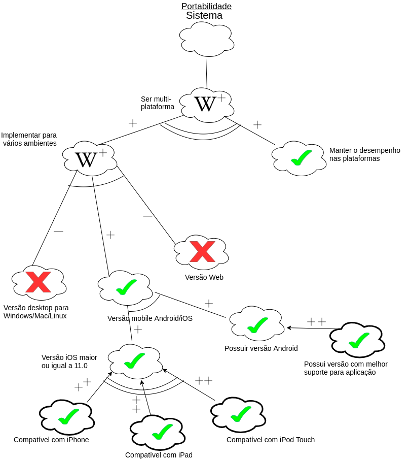

# NFR Softgoal

## Introdução

O NFR é um Framework para auxiliar numa análise mais panorâmica dos requisitos de qualidade de um projeto. Para entender o NFR é necessário primeiramente entender o que são os Requisitos de Qualidade.

Requisitos-não-Funcionais ou Requisitos de Qualidade são requisitos que ditam as regras de negócio do funcionamento de um sistema, ou seja, podem não estar diretamente relacionados ao funcionamento direto do sistema, mas ditam as condições de funcionamento de uma aplicação / sistema.

O NFR utiliza como base os Requisitos não funcionais para fazer uma análise de projeto do impacto que a presença ou não de algum desses requisitos podem causar as diversas áreas do projeto, seja esse impacto positivo ou negativo.

## Objetivo

O objetivo principal do documento é analisar os Requisitos de Qualidade de uma aplicação de detecção de mídia e ter uma visão com as escolhas do Shazam para ver os impactos causados pelas escolhas da aplicação.

## Metodologia

Analisar os impactos das escolhas atuais do Shazam baseadas nos requisitos-não-funcionais já listados no [Backlog](https://requisitos-de-software.github.io/2019.2-Shazam/modelagem/backlog/) do projeto.

## NFR's

### Desempenho

#### NFR de Desempenho v1.0

#### NFR de Usabilidade v1.0

#### NFR de Portabilidade v1.0

## Controle de Versão

|Data | Versão | Alteração | Responsável(eis)|
|:--:|:------:|:---------:|:---------------:|
|16/10/2019|1.0|Criação do Documento|Gabriel Tiveron|
|16/10/2019|1.1|Adição do NFR de Usabilidade|Gabriel Tiveron|
|16/10/2019|1.2|Adição do NFR de Desempenho|Gabriel Tiveron|
|19/10/2019|1.3|Adição do NFR de Portabilidade|Gabriel Tiveron|
