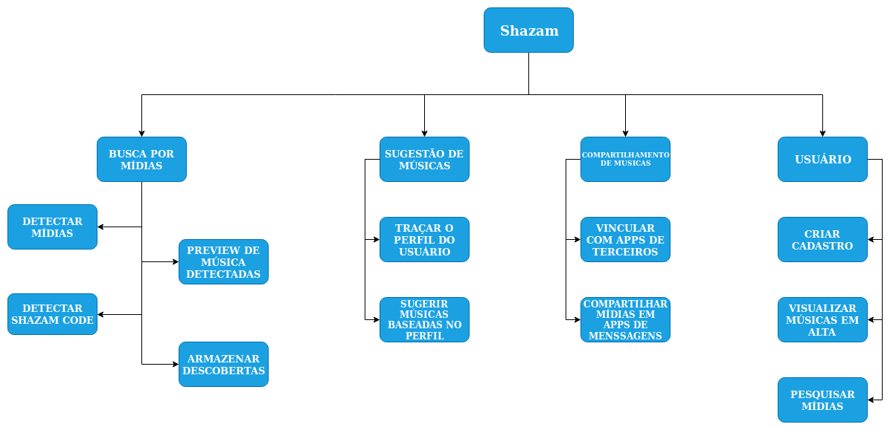

# Estrutura Analítica do Projeto (EAP)

## Introdução

A Estrutura Analítica do Projeto visa projetar toda a estrutura do projeto, suas funções e etc.

## Metodologia

Para a confecção da EAP foi utilizada a metodologia "Regra do 100%" proposta por Haugan. 
> "A Regra 100%... estabelece que a EAP inclui 100% do trabalho definido pelo escopo do projeto e captura todas as entregas – internas, externas, intermediarias – de forma ao trabalho estar completo, incluído o gerenciamento do projeto. A regra dos 100% é um dos mais importantes princípios que guia o desenvolvimento, decomposição e avaliação da EAP. A aplicação desta regra vale para todos os níveis na hierarquia: a soma de todos o trabalho dos níveis "filhos" deve ser igual a 100% do trabalho representado pelo "pai" e a EAP não deve incluir qualquer trabalho que saia do escopo existente do projeto, isto é, ele não pode incluir mais do que 100% do trabalho... É importante lembrar-se que a regra dos 100% também se aplica ao nível de atividades. O trabalho representado pelas atividades de cada pacote deve produzir 100% do trabalho necessário para completar o trabalho do pacote."

<i>Fonte: Introduction to the Practice Standard For Work Breakdown Structures - Second Edition p.8</i>

## EAP

### Controle de Versão

|Data|Versão|Alteração|Responsável(eis)|
|:--:|:----:|:-------:|:--------------:|
|27/11/2019|1.0|Criação do Documento|Gabriel Tiveron|

### Referencias

[Introduction to the Practice Standard For Work Breakdown Structures - Second Edition](http://www.ucipfg.com/Repositorio/MAP/MAPD-05/BLOQUE-ACADEMICO/UNIDAD2/WBS.pdf). Acesso em 27/11/2019.
